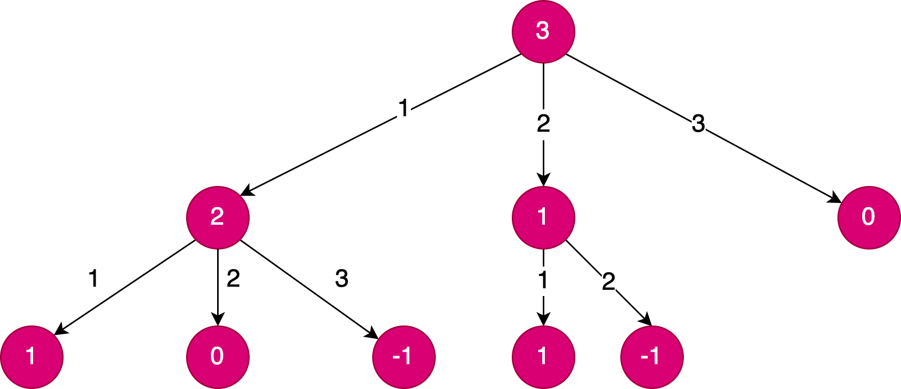
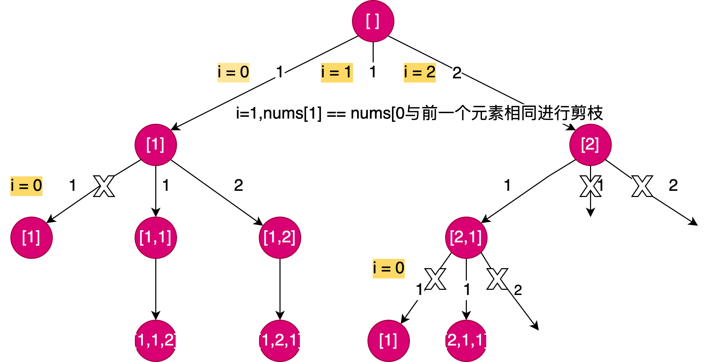
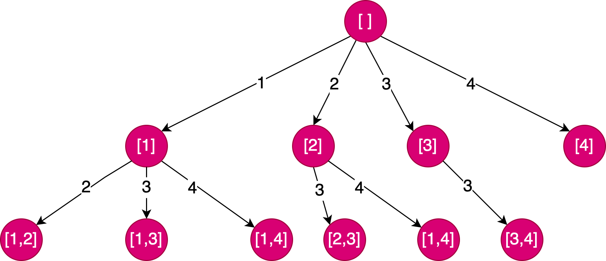

# 回溯法公式

```java
result = []
void backtrack(路径, 选择列表):
if 满足结束条件:
result.add(路径)
return ;

for 选择 in 选择列表:
做选择
backtrack(路径, 选择列表)
撤销选择

```

## 子集组合问题的回溯树


## 排列问题的回溯树


# leetcode_39_combinnation_sum(子集组合问题)
 这里的元素可以复用， 所以当前元素还能继续使用， 即start = i， 而不是start = i+1


```java
public void backTrack(int[] nums, List<List<Integer>> res, List<Integer> temp,  int start, int target) {

        if(target == 0) {
            res.add(new ArrayList<>(temp));
            return ;
        }
        
        if(target < 0) return ;
        
        for(int i=start; i<nums.length; i++) {
            temp.add(nums[i]);
            backTrack(nums, res, temp, i, target-nums[i]);
            temp.remove(temp.size()-1);
        }
    }
    
```
[2,3,6,7] target = 7, 最终得到结论
> [[2,2,3],[7]]

如果start 不变化的话， 会取到重复的组合 [2,2,3], [2,3,2], [3,2,2].. 是不符合题意的

# leetcode_40_combation_sum_ii

> Input: candidates = [10,1,2,7,6,1,5], target = 8
Output:
[
[1,1,6],
[1,2,5],
[1,7],
[2,6]
]

相比于 39 题， 这题不允许使用重复元素， 即start = i + 1
需要注意当前数组是无序的， 在计算前需要先排序
此外因为数组中有重复元素， 如果不做判断的话结果集中会是

> [[1,1,6],[1,2,5],[1,7],[1,2,5],[1,7],[2,6]]

所以需要对重复元素的组合进行判断， 前面使用过的元素不在使用
且相同元素进行剪枝， start = 0， 到第二个1时， 此时i++ = 1， 与前一个1相比发现相同即跳过


> 核心代码 
>  if(i > start && nums[i] == nums[i-1]) continue;

```java
public void backTrack(int[] nums, List<List<Integer>> res, List<Integer> temp,  int start, int target) {

        if(target == 0) {
            res.add(new ArrayList<>(temp));
            return ;
        }
        
        if(target < 0) return ;
        
        for(int i=start; i<nums.length; i++) {
            // 相同元素进行剪枝， start = 0， 到第二个1时， 此时i++ = 1， 与前一个1相比发现相同即跳过
            if(i > start && nums[i] == nums[i-1]) continue;
            temp.add(nums[i]);
            backTrack(nums, res, temp, i+1, target-nums[i]);
            temp.remove(temp.size()-1);
        }
    
    }
```

# leetcode_46_Permutations

> Input: nums = [1,2,3]
> 
> Output: [[1,2,3],[1,3,2],[2,1,3],[2,3,1],[3,1,2],[3,2,1]]

决策树中， 已用过的元素不可以再使用

```java
    private void backTrack(int[] nums, List<List<Integer>> res, ArrayList<Integer> temp) {

        if (temp.size() == nums.length) {
            res.add(new ArrayList<>(temp));
            return ;
        }
        for (int i = 0; i < nums.length; i++) {
                if (temp.contains(nums[i])) {
                    continue;
                }
                temp.add(nums[i]);
                backTrack(res, nums, temp);
                temp.remove(temp.size() - 1);
            }
        }       
    }
```

# leetcode_47_permuations_ii

> Input: nums = [1,1,2]
> 
> Output: [[1,1,2], [1,2,1], [2,1,1]]

这题和46题不同在于数组中是有重复元素出现的， 但是元素不允许重复使用
关键点： 使用过的元素标记为已使用， 同一层级的元素以及下一层级的元素都需要判断

核心代码

>  if (i > 0 && nums[i] == nums[i - 1] && !used[i - 1]) continue;



```java
    private void backTrack(List<List<Integer>> res, int[] nums, ArrayList<Integer> temp, boolean[] used) {

        if (temp.size() == nums.length) {
            res.add(new ArrayList<>(temp));
            return;
        }

        for (int i = 0; i < nums.length; i++) {
            if (used[i]) continue;
            if (i > 0 && nums[i] == nums[i - 1] && !used[i - 1]) continue;
            used[i] = true;
            temp.add(nums[i]);
            backTrack(res, nums, temp, used);
            used[i] = false;
            temp.remove(temp.size() - 1);
        }

    }
```

# leetcode_77_Combinations

核心思路： 决策树中第二层的元素添加， 因为不能重复使用， 使用 start = i+1 

```java
    private void backTrack(int n, List<List<Integer>> res, List<Integer> temp,  int start, int k) {

        if(temp.size() == k) {
            res.add(new ArrayList<>(temp));
            return ;
        }
        
        
        for(int i=start; i<=n; i++) {
            temp.add(i);
            backTrack(n, res, temp, i+1, k);
            temp.remove(temp.size()-1);
            
        }
    }
```
# leetcode_78_subsets (全子集问题，不含重复元素)

```java
    private void backTrack(List<List<Integer>> res, int[] nums, ArrayList<Integer> temp, int start) {

        res.add(new ArrayList<>(temp));

        for (int i = start; i < nums.length; i++) {
            temp.add(nums[i]);
            backTrack(res, nums, temp, i + 1);
            temp.remove(temp.size() - 1);
        }
    }
```


> [[], [1], [1, 2], [1, 2, 3], [1, 3], [2], [2, 3], [3]]


# leetcode_90_subsets_ii

与leetcode_78的区别在于元素内部有重复的， 如何去重是关键

```java
    private void backTrack(int[] nums, List<List<Integer>>  res, List<Integer> temp, int start) {
        
        res.add(temp);
        
        for(int i= start; i<nums.length; i++) {
            // 对相同元素进行剪枝
            if(i>start && nums[i] == nums[i-1]) {
                continue;
            }
            temp.add(nums[i]);
            backTrack(nums, res, temp, i + 1);
            temp.remove(temp.size()-1);

        }
        
    }
```
> Example 1:

> Input: nums = [1,2,2]
> 
> Output: [[],[1],[1,2],[1,2,2],[2],[2,2]]


# leetcode_216_combation_sum_iii

1~9中的数字不允许重复使用，求k个数的和等于n的所有组合

> Input: k = 3, n = 7
> 
> Output: [[1,2,4]]
> 
> Explanation:
> 1 + 2 + 4 = 7
> There are no other valid combinations.

```java
    private void backTrack( List<List<Integer>>  res, List<Integer> temp, int k, int n, int start) {

        if(temp.size() == k && n == 0) {
            res.add(new ArrayList<>(temp));
            return ;
        }
        if(n < 0 || temp.size() > k) return ;

        for(int i= start; i<=9; i++) {
            temp.add(i);
            backTrack(res, temp, k, n-i, i + 1);
            temp.remove(temp.size()-1);

        }

    }
```