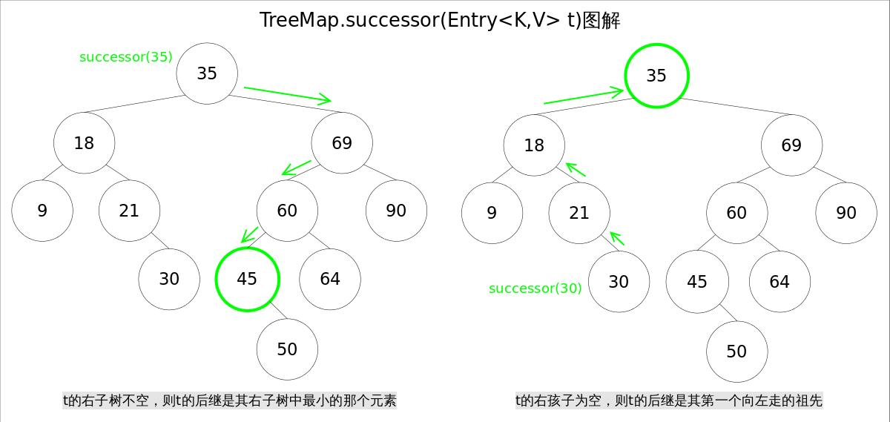

# 给出一个结点，找到当前节点的后继结点

t的右子树不空，则t的后继是其右子树中最小的那个元素。 t的右孩子为空，则t的后继是其第一个向左走的祖先



```java

public class LeetCode_285_InorderSuccessor {
    // 同理找寻前驱结点，如果左子树不为空，找到当前节点的左节点返回即可
    public TreeNode findPrecursor(TreeNode root, TreeNode p) {
        if (root == null || p == null) return null;
        TreeNode t = null;
        while (root != null) {
            if (root.val >= p.val) {
                root = root.left;
            } else {
                t = root;
                root = root.right;
            }
        }
        return t;
    }
    
    public TreeNode successor(TreeNode x) {
        TreeNode successor;
        // 当前节点有右子树， 返回右子树的左叶子节点
        if (x.right != null) {
            successor = x;
            x = x.right;
            while (x.left != null) {
                x = x.left;
                successor = x.left;
            }
            return successor;
        } else {

            TreeNode y = x.getParent();
            // 当前节点没有右子树，找到第一个向左走的祖先
            while (y != null && x == y.right) {
                x = y;
                y = y.parent;
            }

            return y;
        }

    }
    // 如果当前二叉树没有父节点标记，以根节点为当前节点，比当前节点大，当前节点走左子树，比当前节点小， 走右子树， 找到右子树的最小节点或者左子树的根
    public TreeNode inorderSuccessor(TreeNode root, TreeNode p) {
        if (root == null || p == null) return null;
        TreeNode t = null;
        while (root != null) {
            if (root.val > p.val) {
                t = root;
                root = root.left;
            } else {
                root = root.right;
            }
        }
        return t;
    }

    
}

```